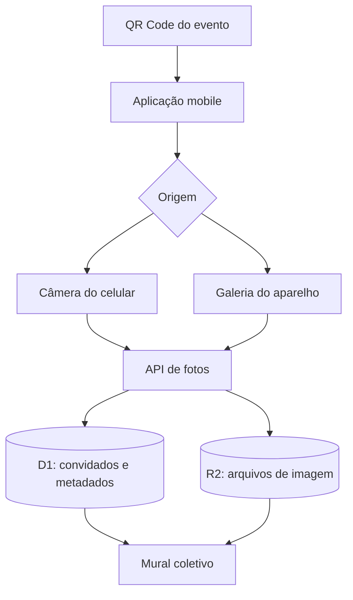

# Arquitetura

## Visão geral

O sistema combina uma interface React otimizada para celulares com rotas de servidor executadas em Cloudflare Workers.

## Componentes

### Interface

`app/page.tsx` controla entrada, consentimento, captura, importação, contador, mensagens de envio e mural. Há dois campos de arquivo: um com `capture="environment"`, que sugere a câmera traseira, e outro sem `capture`, que abre a galeria ou o seletor de arquivos. Ambos usam a mesma rotina de otimização e upload.

`lib/image-optimization.ts` corrige a orientação durante a decodificação, limita a imagem principal a 2.048 pixels, gera uma miniatura de 720 pixels e converte ambas para JPEG otimizado antes da transmissão.

### API

`POST /api/photos` valida e armazena a foto. `GET /api/photos` retorna a galeria e o saldo do convidado. `GET /api/photos/:id` entrega os bytes do objeto armazenado.

### Persistência

D1 guarda identidade anônima, nome, contagem e metadados. R2 guarda os arquivos binários. Essa separação mantém consultas leves e evita armazenar imagens no banco relacional.

### Identificação

O servidor cria o cookie HTTP-only `momentos_guest`, válido por 30 dias. O nome exibido é salvo localmente apenas para conveniência da interface; a contagem oficial permanece no servidor.

O aceite do aviso de privacidade é registrado localmente com a chave `24momentos_privacy_consent`. Ele controla a interface, mas não substitui a política de privacidade e retenção definida pelo responsável pelo evento.

### Administração

A rota `/admin` exige autenticação pelo ChatGPT e compara o e-mail autenticado com `ADMIN_EMAIL`, configurado somente no ambiente de produção. As APIs administrativas repetem essa autorização no servidor. Fotos ocultas deixam de aparecer na listagem pública e também não são entregues pela rota pública de imagem.

## Fluxo de upload

1. O navegador redimensiona e comprime a imagem.
2. O navegador cria uma miniatura independente.
3. A imagem e a miniatura são enviadas em `multipart/form-data`.
4. A API valida tipo, tamanho e assinatura dos dois arquivos.
5. A API verifica e reserva uma unidade da contagem atual.
6. Os dois arquivos são gravados no R2.
7. Os metadados são inseridos no D1.
8. A API devolve o saldo restante.

## Limites atuais

- máximo de 12 MB por imagem;
- imagem principal limitada a 2.048 pixels e miniatura a 720 pixels;
- até 1.200 fotos retornadas por consulta;
- atualização da galeria a cada 6 segundos;
- limite por cookie/dispositivo;
- moderação restrita ao administrador configurado.
