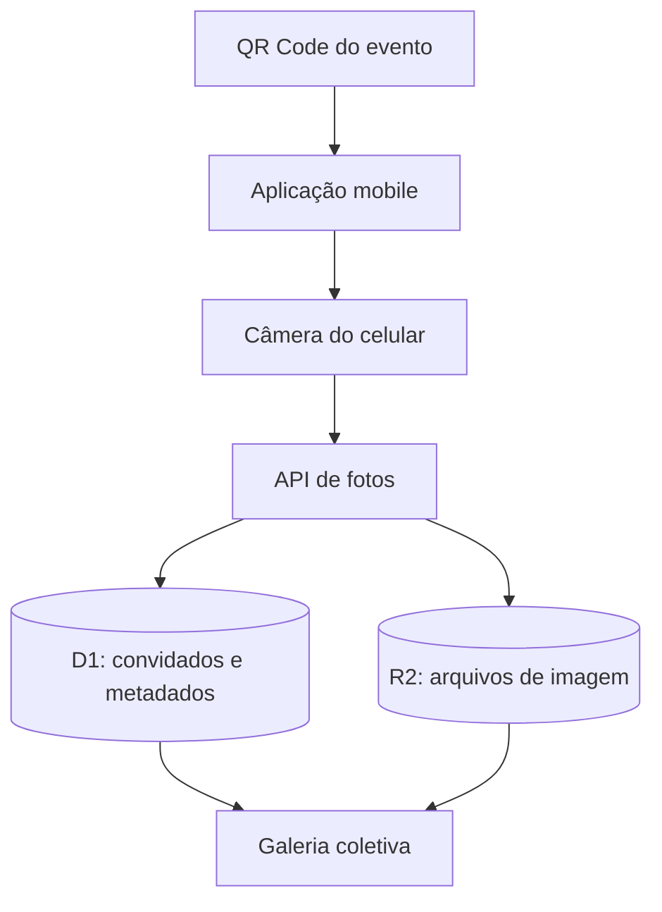

# Arquitetura

## Visão geral

O sistema combina uma interface React otimizada para celulares com rotas de servidor executadas em Cloudflare Workers.

## Componentes

### Interface

`app/page.tsx` controla entrada, captura, contador, mensagens de envio e galeria. A câmera é acionada por um campo de arquivo com `capture="environment"`, que sugere a câmera traseira em dispositivos compatíveis.

### API

`POST /api/photos` valida e armazena a foto. `GET /api/photos` retorna a galeria e o saldo do convidado. `GET /api/photos/:id` entrega os bytes do objeto armazenado.

### Persistência

D1 guarda identidade anônima, nome, contagem e metadados. R2 guarda os arquivos binários. Essa separação mantém consultas leves e evita armazenar imagens no banco relacional.

### Identificação

O servidor cria o cookie HTTP-only `momentos_guest`, válido por 30 dias. O nome exibido é salvo localmente apenas para conveniência da interface; a contagem oficial permanece no servidor.

## Fluxo de upload

1. O navegador envia `multipart/form-data`.
2. A API valida tipo e tamanho.
3. A API verifica a contagem atual.
4. O arquivo é gravado no R2.
5. Os metadados são inseridos no D1.
6. A contagem do convidado é atualizada.
7. A API devolve o saldo restante.

## Limites atuais

- máximo de 12 MB por imagem;
- até 120 fotos retornadas por consulta;
- atualização da galeria a cada 10 segundos;
- limite por cookie/dispositivo;
- sem moderação administrativa nesta versão.
